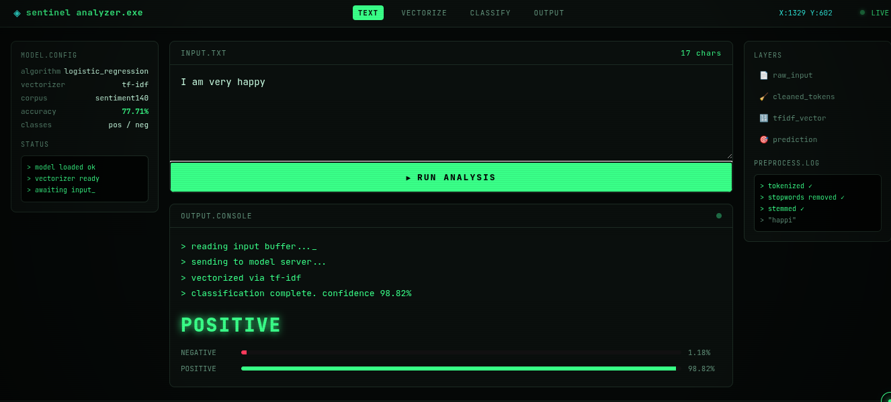

<p style="
padding:18px;
background:linear-gradient(90deg,#0D47A1,#1DA1F2);
margin:0;
color:white;
font-family:Trebuchet MS, sans-serif;
font-size:230%;
font-weight:bold;
text-align:center;
border-radius:20px;
box-shadow:0px 4px 15px rgba(0,0,0,0.3);">
🧠 SENTINEL — Sentiment Analysis Console
</p>
<p align="center">
  
</p>


<p align="center">
  
  
  
  
  
  
</p>

<p style="
background:#F5FBFF;
padding:5px;
border-left:1000px solid #1DA1F2;
border-radius:12px;
font-size:16px;
line-height:1.8;
color:#0D2A4A;">

<b>SENTINEL</b> is an end-to-end <b>Sentiment Analysis</b> system that classifies text as
<b style="color:green;">Positive 😊</b>, <b style="color:red;">Negative 😠</b>, or
<b style="color:orange;">Neutral 😐</b>, trained on the <b>Sentiment140</b> Twitter dataset
(1.6M tweets) using <b>TF-IDF + Logistic Regression</b>, and served through a
<b>Flask</b> backend with a hacker-terminal styled front end (custom cursor, live
coordinate tracker, typewriter console animation, and confidence bars).

</p>

---

<p style="
padding:12px;
background:linear-gradient(90deg,#0D47A1,#1DA1F2);
margin:0;
color:white;
font-family:Trebuchet MS, sans-serif;
font-size:170%;
text-align:center;
border-radius:15px;
font-weight:bold;">
📚 Table of Contents
</p>

| No | Section |
|:--:|:---------|
| 1 | [Overview](#1-overview) |
| 2 | [Features](#2-features) |
| 3 | [Tech Stack](#3-tech-stack) |
| 4 | [Project Structure](#4-project-structure) |
| 5 | [Model Details](#5-model-details) |
| 6 | [Installation](#6-installation) |
| 7 | [Requirements](#7-requirements) |
| 8 | [Setup Instructions](#8-setup-instructions) |
| 9 | [Usage & API Queries](#9-usage--api-queries) |
| 10 | [Screenshots / UI Preview](#10-screenshots--ui-preview) |
| 11 | [Author](#11-author) |
| 12 | [License](#12-license) |

---

<a id="1-overview"></a>
<p style="
padding:12px;
background:#1DA1F2;
color:white;
font-size:170%;
text-align:center;
border-radius:12px;
font-weight:bold;">
1️⃣ Overview
</p>

Text is cleaned and normalized (regex clean → lowercase → stopword removal →
Porter stemming), converted into numerical form using a **TF-IDF vectorizer**,
and classified by a **Logistic Regression** model. The web layer wraps this
pipeline in a Flask API and a real-time front end so you can type or paste
text and instantly see the predicted sentiment with confidence scores.

<a id="2-features"></a>
<p style="
padding:12px;
background:#0D47A1;
color:white;
font-size:170%;
text-align:center;
border-radius:12px;
font-weight:bold;">
2️⃣ Features
</p>

- ✅ Real-time sentiment prediction (Positive / Negative / Neutral)
- ✅ Confidence score breakdown with animated bars
- ✅ Same preprocessing pipeline as training (no train/serve mismatch)
- ✅ Hacker-terminal UI — custom crosshair cursor, live X:Y tracker
- ✅ Typewriter-animated console output
- ✅ Figma-style panel layout (config panel, layers panel, console)
- ✅ Lightweight Flask REST endpoint (`/predict`) — easy to plug into a chatbot
- ✅ No database required — fully stateless inference

<a id="3-tech-stack"></a>
<p style="
padding:12px;
background:#1DA1F2;
color:white;
font-size:170%;
text-align:center;
border-radius:12px;
font-weight:bold;">
3️⃣ Tech Stack
</p>

| Layer | Technology |
|---|---|
| Language | Python 3.10+ |
| ML / NLP | scikit-learn, NLTK |
| Vectorization | TF-IDF (`TfidfVectorizer`) |
| Model | Logistic Regression |
| Backend | Flask |
| Frontend | HTML5, CSS3, Vanilla JavaScript |
| Model Persistence | joblib (`.pkl`) |
| Training Environment | Jupyter Notebook (Kaggle) |

<a id="4-project-structure"></a>
<p style="
padding:12px;
background:#0D47A1;
color:white;
font-size:170%;
text-align:center;
border-radius:12px;
font-weight:bold;">
4️⃣ Project Structure
</p>

```
sentiment-app/
├── app.py                          # Flask backend + preprocessing + inference
├── requirements.txt                # Python dependencies
├── sentiment_logistic_model.pkl    # Trained Logistic Regression model
├── sentiment_vectorizer_1_.pkl     # Fitted TF-IDF vectorizer
├── sentiments-analysis.ipynb       # Training notebook (EDA → model → export)
├── templates/
│   └── index.html                  # Main UI (Figma-style layout)
├── static/
│   ├── css/
│   │   └── style.css               # Hacker theme, cursor, animations
│   └── js/
│       └── script.js               # Cursor tracking, typewriter, fetch calls
└── assets/
    └── sentiment-mood-icons.png    # Sentiment reference icons
```

<a id="5-model-details"></a>
<p style="
padding:12px;
background:#1DA1F2;
color:white;
font-size:170%;
text-align:center;
border-radius:12px;
font-weight:bold;">
5️⃣ Model Details
</p>

| Property | Value |
|---|---|
| Dataset | Sentiment140 (1.6M labeled tweets) |
| Classes | `0` = Negative, `1` = Positive |
| Preprocessing | Regex clean → lowercase → stopword removal → Porter stemming |
| Feature Extraction | TF-IDF (vocabulary size: 422,739) |
| Algorithm | Logistic Regression (`max_iter=1000`) |
| Test Accuracy | **77.71%** |
| Neutral Handling | App-level: predictions with 0.45–0.55 positive-probability are labeled *Neutral* (the base model itself is binary) |

<a id="6-installation"></a>
<p style="
padding:12px;
background:#0D47A1;
color:white;
font-size:170%;
text-align:center;
border-radius:12px;
font-weight:bold;">
6️⃣ Installation
</p>

```bash
git clone <your-repo-url>
cd sentiment-app
python -m venv venv
source venv/bin/activate        # Windows: venv\Scripts\activate
pip install -r requirements.txt
```

<a id="7-requirements"></a>
<p style="
padding:12px;
background:#1DA1F2;
color:white;
font-size:170%;
text-align:center;
border-radius:12px;
font-weight:bold;">
7️⃣ Requirements
</p>

```
flask
scikit-learn
joblib
nltk
```

<a id="8-setup-instructions"></a>
<p style="
padding:12px;
background:#0D47A1;
color:white;
font-size:170%;
text-align:center;
border-radius:12px;
font-weight:bold;">
8️⃣ Setup Instructions
</p>

```bash
# 1. Download NLTK stopwords (one-time)
python -c "import nltk; nltk.download('stopwords')"

# 2. Make sure these files sit in the project root:
#    sentiment_logistic_model.pkl
#    sentiment_vectorizer_1_.pkl

# 3. Run the Flask app
python app.py

# 4. Open in browser
http://127.0.0.1:5000
```

<a id="9-usage--api-queries"></a>
<p style="
padding:12px;
background:#1DA1F2;
color:white;
font-size:170%;
text-align:center;
border-radius:12px;
font-weight:bold;">
9️⃣ Usage & API Queries
</p>

**Via the UI:** type text into the input console → click `▶ RUN ANALYSIS`.

**Via the API directly:**

```bash
curl -X POST http://127.0.0.1:5000/predict \
  -H "Content-Type: application/json" \
  -d '{"text": "I absolutely love this!"}'
```

**Sample response:**

```json
{
  "label": "POSITIVE",
  "confidence": 91.42,
  "neg_score": 8.58,
  "pos_score": 91.42,
  "cleaned_input": "absolut love"
}
```

**Try these test inputs:**

| Input | Expected |
|---|---|
| "I absolutely love this product, best purchase ever!" | Positive |
| "This is the worst service I have ever experienced" | Negative |
| "The event starts at 5pm tomorrow" | Neutral / low confidence |

<a id="10-screenshots--ui-preview"></a>
<p style="
padding:12px;
background:#0D47A1;
color:white;
font-size:170%;
text-align:center;
border-radius:12px;
font-weight:bold;">
🔟 Screenshots / UI Preview
</p>

<p align="center">
  
</p>

<a id="11-author"></a>
<p style="
padding:12px;
background:#1DA1F2;
color:white;
font-size:170%;
text-align:center;
border-radius:12px;
font-weight:bold;">
1️⃣1️⃣ Author
</p>

**Ali Husnain**
BS Artificial Intelligence — Superior University Lahore
AI/ML Content Creator · Co-founder, CodeX Community

- GitHub: [github.com/AliDeveloper-dev](https://github.com/AliDeveloper-dev)
- Live Projects: [alihusnain.pythonanywhere.com](https://alihusnain.pythonanywhere.com)

<a id="12-license"></a>
<p style="
padding:12px;
background:#0D47A1;
color:white;
font-size:170%;
text-align:center;
border-radius:12px;
font-weight:bold;">
1️⃣2️⃣ License
</p>

This project is open for educational and personal use. Add a formal license
file (e.g. MIT) if you plan to publish it publicly.

---

<p align="center" style="color:#1DA1F2; font-weight:bold;">
Made with 🐍 Python, 🧠 scikit-learn, and a lot of ☕
</p>
